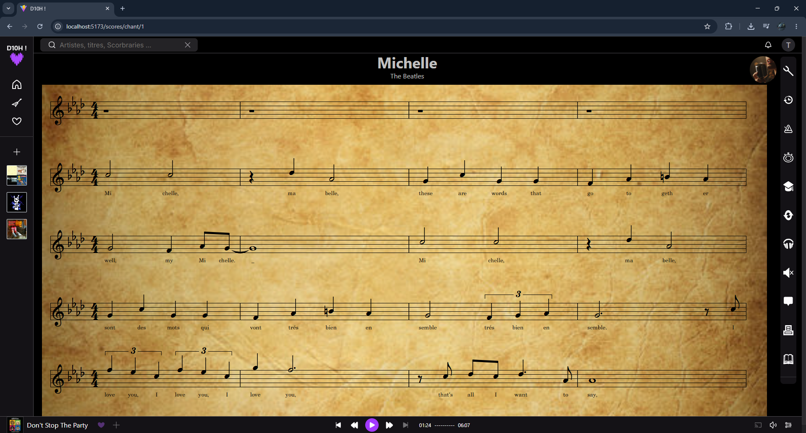

# D10H

Main project during web developer course in Angoulême's AFEC centre :

D10H is a Third-party application using the Deezer API to provide a complementary synchronized music learning service

## Installation

Pour l'instalation il est necessaire d'avoir **Docker** d'installé  
https://www.docker.com/get-started/

1. Clone Repository :

   ```bash
   git clone https://github.com/SagWel/D10H.git
   cd D10H
   ```

2. Creat and edit .env front :

   ```bash
   cd client
   cp .env.example .env
   ```

   Edit VITEHOST *localhost* sauf si configuration personel autre

3. Creat and edit .env back :

   ```bash
   cd../server
   cp .env.example .env
   ```

   Edit MYSQL_HOST, MYSQL_PORT, MYSQL_NAME, MYSQL_USER and MSQL_PWD with db environement content in `docker-commpose.yml`

4. Start Docker service :

   ```bash
   cd ..
   docker-compose up -d --build
   ```

5. Go to D10H :

   http://localhost:5173/

## Technologies

- CSS / ChakraUI 2 / TypeScript
- React
- VexFlow 5
- JWT
- PHP
- Docker

## Features

1. Implemented
   - Login
   - Registering
   - Select one or more instruments and the appropriate level at first login
   - Configure Profil (password, gender, username, instruments and the appropriate level, date of birth)
   - Search for Score, filter and sort the results
   - Delete Profil
   - Configure the display of explicit content (set to “no explicit content” by default for children)
   - Display Score and start playing it

2. In the future
   - Submit a suggestion for a score if it doesn't appear in the results
   - Full mailling system
   - Playlist system called 'Scorebraies'
   - Popularity system for scores
   - Shuffle score select button system for Favorites page
   - Private infos and personal data management infos on account page
   - Add more security for deleting account
   - Add pause or playing choice if visibilityState change to 'hidden'
   - Full notifications system
   - All tools buttons fonction
   - Connect to a SDK
   - Renderring Scores new system
   - Button to simplifing score view
   - Preview audio on Score cards
   - New carousels for more than just scores
   - Searchbar stabilisation

## Tree Structure

D10H  
├── Prototype D10H !.url  
├── README.md  
├── client  
│ ├── Dockerfile  
│ ├── index.html  
│ ├── public  
│ │ ├── data  
│ │ │ └── scores.json  
│ │ ├── imgs  
│ │ │ └── FondPart.jpg  
│ │ └── svg  
│ │ └── logo-horizontal-white-text.svg  
│ ├── seed.cjs  
│ └── src  
│ ├── App.tsx  
│ ├── components  
│ │ ├── MenuSelect.tsx  
│ │ ├── OtherCarousel.tsx  
│ │ ├── ScoreCarousel.tsx  
│ │ ├── ScoreRender.tsx  
│ │ ├── Svg.tsx  
│ │ ├── UserInstrumentManagement.tsx  
│ │ ├── buttons  
│ │ │ ├── StandardButton.tsx  
│ │ │ └── ToolButton.tsx  
│ │ ├── cards  
│ │ │ ├── InstrumentCard.tsx  
│ │ │ ├── OtherInstrumentCard.tsx  
│ │ │ └── ScoreCard.tsx  
│ │ ├── layout  
│ │ │ ├── BarNav.tsx  
│ │ │ ├── BarNavMin.tsx  
│ │ │ ├── Header.tsx  
│ │ │ ├── HeaderMin.tsx  
│ │ │ ├── Playeur.tsx  
│ │ │ ├── PlayeurMin.tsx  
│ │ │ └── Tools.tsx  
│ │ ├── modals  
│ │ │ ├── ModalManager.tsx  
│ │ │ ├── StandardModal.tsx  
│ │ │ └── childrens  
│ │ │ ├── FirstEditProfil.tsx  
│ │ │ └── TempoManager.tsx  
│ │ └── scoreRendering  
│ │ └── ScoreRenderSing.tsx  
│ ├── context  
│ │ ├── AuthContext.tsx  
│ │ ├── ModalsContext.tsx  
│ │ ├── PlayScoreContext.tsx  
│ │ ├── ScoreContext.tsx  
│ │ └── SearchContext.tsx  
│ ├── hooks  
│ │ ├── useAuth.tsx  
│ │ ├── useModals.tsx  
│ │ ├── usePlayScore.tsx  
│ │ ├── useScore.tsx  
│ │ ├── useSearchHistory.tsx  
│ │ └── useWindowWidth.tsx  
│ ├── main.tsx  
│ ├── pages  
│ │ ├── connected  
│ │ │ ├── PageAllInstruments.tsx  
│ │ │ ├── PageHome.tsx  
│ │ │ ├── PageMorceau.tsx  
│ │ │ ├── PageSearch.tsx  
│ │ │ ├── PageSearchInstrument.tsx  
│ │ │ ├── PageUserInstruments.tsx  
│ │ │ ├── account  
│ │ │ │ ├── PageAccount.tsx  
│ │ │ │ ├── PageAccountCountry.tsx  
│ │ │ │ ├── PageAccountDevices.tsx  
│ │ │ │ ├── PageAccountDisplay.tsx  
│ │ │ │ ├── PageAccountNotifications.tsx  
│ │ │ │ ├── PageAccountShare.tsx  
│ │ │ │ └── PageApps.tsx  
│ │ │ └── favoris  
│ │ │ ├── PageFavoris.tsx  
│ │ │ ├── PageHistory.tsx  
│ │ │ ├── PageScorbaries.tsx  
│ │ │ └── PageScorbrary.tsx  
│ │ └── disconnected  
│ │ ├── PageInfos.tsx  
│ │ ├── PageLogin.tsx  
│ │ ├── PageResetPassword.tsx  
│ │ └── PageSignup.tsx  
│ ├── style.css  
│ ├── theme.ts  
│ └── types  
│ ├── Deezer.ts  
│ ├── Score.ts  
│ ├── global.ts  
│ ├── instrument.ts  
│ └── user.ts  
├── db  
│ ├── init.sql  
│ ├── install.php  
│ └── seed.sql  
├── docker-compose.yml  
├── personas.md  
├── schéma_bdd.png  
├── screenshot.png  
└── server  
 ├── Dockerfile  
 ├── config  
 │ └── db.php  
 ├── controllers  
 │ ├── addUserHistoryController.php  
 │ ├── allInstrumentsController.php  
 │ ├── authController.php  
 │ ├── checkAuthController.php  
 │ ├── creatUserController.php  
 │ ├── creatUserInstrumentsController.php  
 │ ├── deleteAccountController.php  
 │ ├── editPasswordController.php  
 │ ├── filterExplicitController.php  
 │ ├── foundByEmailController.php  
 │ ├── historyController.php  
 │ ├── logoutController.php  
 │ ├── newsController.php  
 │ ├── popularController.php  
 │ ├── scoreController.php  
 │ ├── scoresInstrumentsController.php  
 │ ├── searchScoreController.php  
 │ ├── suggestionsController.php  
 │ ├── updateProfilController.php  
 │ └── userInstrumentsController.php  
 ├── middlewares  
 │ ├── CheckCreatUser.php  
 │ ├── CheckEditPassword.php  
 │ ├── CheckEmail.php  
 │ ├── CheckFilterExplicitChoice.php  
 │ ├── CheckInstrument.php  
 │ ├── CheckLogin.php  
 │ ├── CheckNumericId.php  
 │ ├── CheckProfilInputs.php  
 │ └── CheckQuery.php  
 ├── models  
 │ ├── instrumentsModel.php  
 │ ├── scoresModel.php  
 │ └── userModel.php  
 ├── public  
 │ ├── index.php  
 │ └── uploads  
 │ ├── avatars  
 │ ├── instruments  
 │ │ ├── Basse.png  
 │ │ ├── Batterie.png  
 │ │ ├── Chant.png  
 │ │ ├── Flute.png  
 │ │ ├── Guitare.png  
 │ │ ├── Piano.png  
 │ │ ├── Saxophone.png  
 │ │ └── Ukulele.png  
 │ └── previews  
 │ └── partition_1.png  
 ├── utils  
 └── └── mapperScores.php

## Preview


